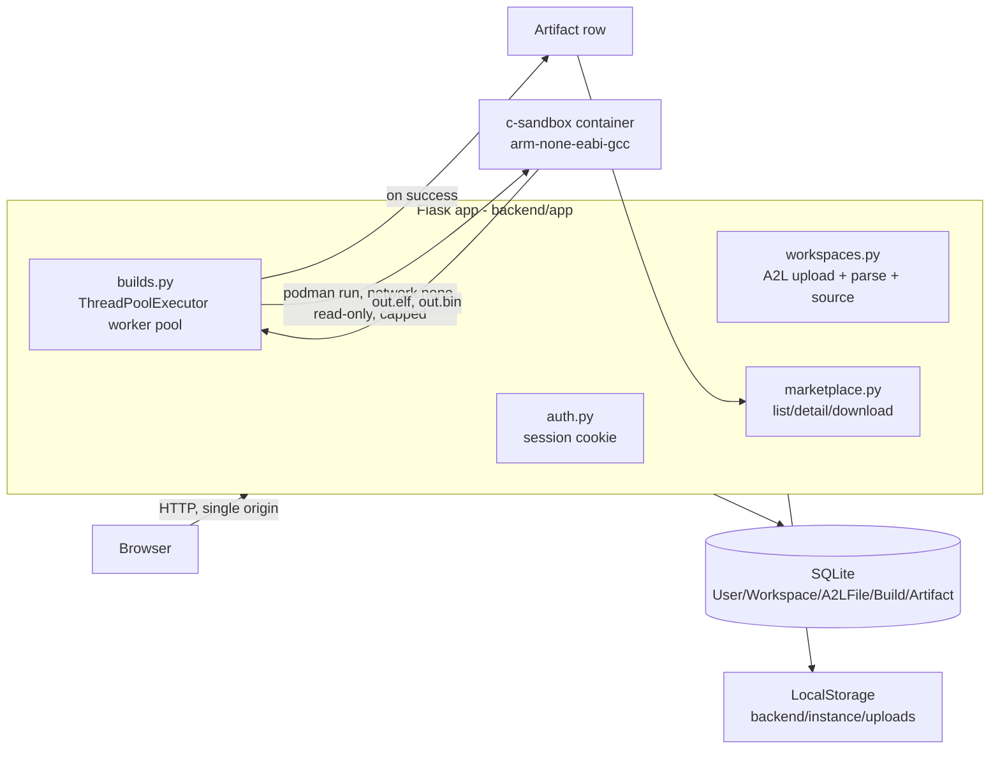

# Cortex Studio

Browser-based C development environment for embedded (Cortex-M) targets.
Built in phases; see `plan/` for the phase-by-phase spec and
`docs/DECISIONS.md` for design decisions and scope cuts.

## Status

All 5 phases complete. Auth -> workspaces -> A2L parsing/signal discovery ->
Monaco editor + header generation -> sandboxed `arm-none-eabi-gcc`
compilation -> a shared marketplace of successful build artifacts. See
`docs/SECURITY.md` for the full compilation threat model — read this before
touching anything in `backend/app/compiler.py` or `backend/sandbox/`.

## Architecture overview



One Flask process serves both the JSON API (`/api/*`) and the built React
SPA (everything else), so there is a single origin and no CORS/cross-site
cookie configuration in production (see `docs/DECISIONS.md` Phase 1). Each
compile runs in its own short-lived, network-isolated Podman container
launched by `backend/app/compiler.py`; on success the binary is written to
storage and a `Build` row (Phase 4) plus an `Artifact` row (Phase 5, one per
successful build) are created so it shows up in the marketplace.

## Architecture (phase 4 additions)

- **Compiler** (`backend/app/compiler.py`): given a workspace's saved
  source and parsed A2L signals, writes an isolated per-build temp dir
  (`user.c`, generated `signals.h`/`signals_def.c`, the fixed
  `build/startup.c`/`build/link.ld`) and runs a single, fully
  server-controlled `podman run` against it — `--network none`, memory/pids/
  cpu caps, `--read-only` rootfs, `--cap-drop=ALL`,
  `--security-opt no-new-privileges`, non-root `--user`, and a wall-clock
  timeout that force-kills the container. The user never supplies a
  compiler flag or path — only the contents of `user.c`. Full threat model,
  exact flags, and honest residual risks: **`docs/SECURITY.md`**.
- **Sandbox image** (`backend/sandbox/Containerfile`): Debian bookworm-slim
  + the `gcc-arm-none-eabi` package (GNU Arm Embedded Toolchain — upstream:
  https://developer.arm.com/downloads/-/arm-gnu-toolchain-downloads),
  non-root `builder` user, fixed `ENTRYPOINT` (`build.sh`) that always runs
  the same two commands (`arm-none-eabi-gcc ... -o out.elf` then
  `arm-none-eabi-objcopy -O binary`) regardless of any argv passed in.
  Build it once locally: `podman build -t c-sandbox:latest -f
  backend/sandbox/Containerfile backend/sandbox`.
- **Fixed build contract** (`build/startup.c`, `build/link.ld`): a minimal
  Cortex-M4 vector table + reset handler and a generic-but-fixed linker
  script, checked into the repo so builds are deterministic and never
  depend on user-supplied linker bits.
- **`signals_def.c`** (`header_gen.py::generate_definitions`): a companion
  to `signals.h` — one zero-initialised tentative definition per declared
  signal, so the `extern`s in `signals.h` have something to link against
  (compile-time contract only, see `signals.h`'s own banner comment).
- **Build model + API** (`backend/app/models.py::Build`,
  `backend/app/builds.py`):
  - `POST /api/workspaces/<id>/builds` → enqueue a build of the current
    saved source (owner only); rejects with 429 if the caller already has
    a build queued/running.
  - `GET /api/builds/<id>` → poll status + full log (owner only).
  - `GET /api/workspaces/<id>/builds` → recent builds for a workspace.
  - Runs on a bounded `ThreadPoolExecutor` (`BUILD_WORKER_COUNT`, default
    2) so a burst of requests queues instead of spawning unbounded
    containers.
- **Frontend**: a Compile button + log console panel in the workspace view
  (`frontend/src/pages/Workspace.jsx`) — polls `GET /api/builds/<id>` and
  shows the real compiler stdout/stderr (warnings and errors, not a
  pass/fail badge), plus final status and duration.

## Architecture (phase 5 additions)

- **`Artifact` model** (`backend/app/models.py`): one row per *successful*
  build, created inline in `builds.py::_run_build_job` right after the raw
  `objcopy` binary is written to storage. Deliberately thin — it only adds
  `filename`, `size_bytes`, `download_ref`, its own `created_at`, and a
  `build_id` FK; everything else the brief requires (full log, build
  duration, timestamps, workspace, user) is read through `Artifact.build`
  rather than duplicated. See `docs/DECISIONS.md` Phase 5.
- **Marketplace API** (`backend/app/marketplace.py`):
  - `GET /api/marketplace` → list every successful-build artifact
    (filename, workspace, user, created-at, duration, size) — no per-owner
    filtering, see the visibility model below.
  - `GET /api/artifacts/<id>` → one artifact's full detail, including the
    complete build log.
  - `GET /api/artifacts/<id>/download` → the raw binary
    (`application/octet-stream`, `Content-Disposition: attachment`).
  - All three require login (`@login_required`) but not ownership.
- **Visibility model: all-public-to-logged-in-users.** Every artifact from
  every workspace/user is browsable and downloadable by any authenticated
  account — this is the literal reading of the phase goal ("a shared,
  browsable catalogue"). Full reasoning + rejected alternatives (owner-only,
  public-browse/owner-download) in `docs/DECISIONS.md` Phase 5.
- **Frontend** (`frontend/src/pages/Marketplace.jsx`,
  `ArtifactDetail.jsx`): a plain HTML table (name/workspace/user/date/
  duration/status) linking to a detail page with the full build log and a
  Download button. Reachable via a "Marketplace" link on the landing page
  and the workspace list header.
- **`backend/seed.py`**: idempotent script that creates >=2 test accounts
  from `SEED_USER{1,2}_EMAIL`/`_PASSWORD` env vars, or generates and prints
  a random password if unset. Never hardcodes credentials — see "Run
  locally" below and `docs/DECISIONS.md` Phase 5.

## Architecture (phase 3 additions)

- **Editor** (`frontend/src/pages/Workspace.jsx`): `@monaco-editor/react`
  (`language="c"`) loads the workspace's saved source on open (falling back
  to a starter template that `#include`s `"signals.h"`), edits locally,
  and saves via an explicit Save button (see `docs/DECISIONS.md` for why
  not autosave-on-debounce).
- **Source persistence**: `Workspace.source_code` (nullable `TEXT`) via
  `GET`/`PUT /api/workspaces/<id>/source`, owner-only, 256 KB cap enforced
  server-side on the UTF-8 byte length.
- **Signal discovery panel**: same page, calls the phase 2
  `GET /api/workspaces/<id>/signals` endpoint, is searchable (client-side
  filter over the 173-signal sample), and clicking a signal inserts its
  sanitised C identifier at the Monaco cursor.
- **Header generation** (`backend/app/header_gen.py`): `generate_header()`
  turns the parsed MEASUREMENT list into a deterministic `signals.h` —
  A2L datatype → `<stdint.h>` type via a fixed table (unknown datatypes are
  skipped with a comment, never guessed), illegal-for-C names (dots/
  brackets) sanitised into identifiers with the original name kept in a
  trailing comment, `MATRIX_DIM` signals become array declarations. Served
  at `GET /api/workspaces/<id>/signals.h` (`text/plain`, owner-only,
  regenerated fresh from the workspace's current parsed signals on every
  request — no stale-cache problem on re-upload). See `docs/DECISIONS.md`
  for why a header (not accessor stubs or `-D` injection) and the "not
  real linkage" caveat.

## Architecture (phase 2 additions)

- **Workspaces** (`backend/app/models.py`): a `Workspace` belongs to one
  `User` (`owner_id`) and has at most one `A2LFile`. Every workspace route
  (`backend/app/workspaces.py`) looks the workspace up scoped to
  `owner_id == session["user_id"]` and returns 404 (not 403) if it doesn't
  belong to the caller — see `docs/DECISIONS.md`.
- **Storage** (`backend/app/storage.py`): uploaded `.a2l` files are written
  through a small `LocalStorage` interface (`write_bytes`/`read_text`/
  `delete`) rather than direct filesystem calls, so a Cloudflare R2-backed
  implementation can be dropped in later without touching the routes.
- **A2L parser** (`backend/app/a2l_parser.py`): a line-scanner (not a full
  ASAM grammar) that extracts MEASUREMENT and CHARACTERISTIC blocks —
  name, datatype, ECU address, limits, compu_method, matrix_dim — and
  normalises them into the signal shape the API returns. Verified against
  `_resources/Reference_a2l.a2l`: 173 measurements, 0 characteristics.
  CHARACTERISTIC field extraction is intentionally not implemented (see
  `docs/DECISIONS.md`) since the sample has none to verify against.
- **API**:
  - `POST /api/workspaces` `{name}` → create
  - `GET /api/workspaces` → list caller's workspaces
  - `GET /api/workspaces/<id>` → details (owner only)
  - `DELETE /api/workspaces/<id>` → delete (owner only)
  - `POST /api/workspaces/<id>/a2l` → multipart upload, field name `file`,
    `.a2l` extension only, 5 MB cap; stores the raw file and the parsed
    signals/summary
  - `GET /api/workspaces/<id>/signals` → parsed signals + summary
    (measurement/characteristic counts, datatypes seen, skipped blocks)
  - `GET /api/workspaces/<id>/source` → `{code}` saved C source (or `null`)
  - `PUT /api/workspaces/<id>/source` `{code}` → save C source, 256 KB cap
  - `GET /api/workspaces/<id>/signals.h` → generated header (`text/plain`)

## Run locally

### Sandbox image (required for compilation, Phase 4)

Needs [Podman](https://podman.io/) installed (on Windows: `podman machine
init` + `podman machine start` first). Build the sandbox image once:

```bash
podman build -t c-sandbox:latest -f backend/sandbox/Containerfile backend/sandbox
```

Verify the toolchain (matches what `docs/SECURITY.md` documents as tested):

```bash
podman run --rm --entrypoint arm-none-eabi-gcc c-sandbox:latest --version
```

Without this image, workspace source can still be saved/edited, but
`POST /api/workspaces/<id>/builds` will fail (podman/image not found) — the
error shows up in the build's log, not a silent failure.

### Backend (Flask)

```bash
cd backend
python -m venv venv
source venv/Scripts/activate   # Windows Git Bash; use `venv\Scripts\activate` in cmd, or `source venv/bin/activate` on Linux/Mac
pip install -r requirements.txt

cp .env.example .env
# edit .env and set a real SECRET_KEY, e.g.:
#   python -c "import secrets; print(secrets.token_hex(32))"

export FLASK_APP=app.py
flask db upgrade   # applies migrations, creates the sqlite DB

python app.py       # runs on http://127.0.0.1:5000
```

Required env vars (see `backend/.env.example`):
- `SECRET_KEY` — required, no default. Used to sign the Flask session cookie.
- `DATABASE_URL` — defaults to `sqlite:///app.db`.
- `ENV` — `development` (default) or `production`. Controls the
  `Secure` flag on the session cookie.

### Test accounts (brief requires >=2)

```bash
cd backend
source venv/Scripts/activate
python seed.py
```

Idempotent — safe to re-run. Without `SEED_USER1_EMAIL`/`SEED_USER1_PASSWORD`
(and `SEED_USER2_*`) set, it creates `tester1@example.com`/`tester2@example.com`
with a random generated password printed once to stdout. Real credentials
for the deployed submission are in the private submission note, not this
repo — see `docs/DECISIONS.md` Phase 5.

### Frontend (Vite React)

Two workflows:

**Dev mode** (hot reload, Vite dev server proxies `/api/*` to Flask on
`127.0.0.1:5000`):

```bash
cd frontend
npm install
npm run dev   # http://localhost:5173, proxies /api to Flask
```

Run the Flask backend at the same time (see above) — the Vite dev
server does not serve the API itself.

**Production build** (single origin — Flask serves the built SPA):

```bash
cd frontend
npm install
npm run build   # outputs frontend/dist
```

Then just run the Flask backend (`python app.py` from `backend/`) and
visit `http://127.0.0.1:5000/` — Flask serves `frontend/dist/index.html`
and its assets, and the whole auth flow (signup/login/logout) works on
that single port with no CORS configuration.

### Tests

```bash
cd backend
source venv/Scripts/activate
python -m pytest tests/ -v
```

## Repo layout

```
/backend           Flask app (app factory, models, auth blueprint, migrations)
/backend/sandbox    Containerfile + fixed entrypoint script for the compile sandbox
/backend/seed.py    Seeds >=2 test accounts (idempotent)
/build              Fixed startup.c + link.ld shared by every sandboxed build
/frontend          Vite + React SPA
/docs              DECISIONS.md, SECURITY.md — decisions/cuts and the compile threat model
/plan              Phase specs for AI-agent-driven development
```

## Key design decisions

The full append-only log, with rejected alternatives and reasoning, is in
**`docs/DECISIONS.md`**. The ones most worth reading first:

- Session-cookie auth + Flask-serves-React (single origin, no CORS).
- A2L parsed with a line-scanner, not a full ASAM grammar — matches the
  brief's explicit "don't build full spec coverage" scope cut.
- Signals reach C code via a generated header (`signals.h` + zero-init
  `signals_def.c`), not accessor stubs or `-D` injection.
- Every compile runs inside a fully server-controlled, locked-down Podman
  container — the user only ever supplies the *contents* of one `.c` file,
  never a flag, path, or filename.
- Marketplace visibility is all-public-to-logged-in-users, not owner-only —
  see `docs/DECISIONS.md` Phase 5 for the reasoning and the two rejected
  alternatives.

## Security posture

Compiling arbitrary user-submitted C on the server is the sharp edge of
this project. The full threat model (8 numbered threats, exact `podman run`
flags, mitigation vs. residual risk per threat, and real observed evidence
— including a real compile-time DoS the sandbox actually caught) lives in
**`docs/SECURITY.md`**. Read it before changing anything in
`backend/app/compiler.py` or `backend/sandbox/`. Short version: every build
runs in a `--network none`, memory/pids/cpu-capped, `--read-only`,
non-root, all-capabilities-dropped container with a wall-clock timeout that
force-kills it; the compiler invocation itself is a fixed script baked into
the image, so user input never reaches a shell or command line.

## Known limitations, bugs, and cuts

Every scope cut is also logged with its reasoning in `docs/DECISIONS.md`;
this is the flat summary an evaluator can skim.

- **No browser-automation tool was available in this development
  environment.** Every phase's UI (editor, signal panel, compile console,
  marketplace table/detail page) was verified by: a clean `npm run build`
  (no JSX/import errors) plus exercising the exact API calls each page
  makes against a real running Flask server with real data (real podman
  compiles, a real 173-signal A2L file) — see each phase hand-off in
  `_plan/handoffs/` for the actual command transcripts. The pages were
  never click-tested in an actual browser by an agent. If you can open a
  browser, the golden path to check is exactly the one in "End-to-end
  smoke test" below.
- **No SSE/streaming build output** — polling `GET /api/builds/<id>` every
  ~800ms instead, explicitly allowed by the brief. See `docs/DECISIONS.md`
  Phase 4.
- **No custom seccomp profile** for the sandbox — relies on Podman's
  default. See `docs/SECURITY.md` T5.
- **Rootless Podman is a deploy-host configuration, not code-enforced** —
  `compiler.py` issues the same `podman run` regardless of whether the
  daemon it's talking to is rootless or rootful. See `docs/SECURITY.md`
  T3/T5 and `_plan/06_devops_instructions.txt`.
- **CHARACTERISTIC blocks**: name/kind only, no field extraction — the
  reference sample has zero CHARACTERISTIC blocks to verify a field mapping
  against, so nothing was guessed. See `docs/DECISIONS.md` Phase 2.
- **Resource caps (256m memory, 64 pids, 1 cpu, 15s timeout) are untuned
  guesses**, not load-tested against a wide range of real programs. See
  `docs/SECURITY.md` T2.
- **No sliding-window rate limit** — "one outstanding build per user" is
  enforced, but a well-behaved single client has no cap on sequential
  builds/hour. See `docs/DECISIONS.md` Phase 4.
- **Marketplace has no delete/unpublish** — every successful build is
  permanently in the catalogue (matches the "shared catalogue" reading of
  the brief); out of scope per ground rules (no rating/moderation
  features).
- **No pagination on `GET /api/marketplace`** — returns every artifact in
  one response. Fine at this project's scale (a handful of test builds);
  would need paging before it's used at real volume.

## Time spent

Built phase-by-phase across 5 phases (auth/skeleton, workspaces + A2L
parser, editor + header generation, compilation sandbox, marketplace +
polish). The compilation phase (Phase 4) took the largest share of the
total time — most of it went into getting the Podman sandbox flags right
and verifying the threat model by actually attacking the sandbox (macro-
bomb, forced timeout, checking for orphaned containers) rather than just
writing the `podman run` call. Phase 5 (this one) was comparatively quick
since `Build` already carried nearly all the metadata the marketplace
needed — most of the phase 5 work was the marketplace UI, the visibility
decision, and finalizing this README.

## Attribution

- **`arm-none-eabi-gcc`** (GNU Arm Embedded Toolchain), installed via
  Debian's `gcc-arm-none-eabi` package inside the sandbox image — see
  `docs/DECISIONS.md` Phase 4 for the exact version and why apt over a
  hand-downloaded tarball. Upstream:
  https://developer.arm.com/downloads/-/arm-gnu-toolchain-downloads
- **`@monaco-editor/react`** — the code editor component (required by the
  brief; not a custom editor).
- **Flask, SQLAlchemy, Flask-Migrate, Werkzeug** — backend framework/ORM/
  migrations/password-hashing, standard PyPI packages, no forks or
  vendored modifications.
- **React + Vite + react-router-dom** — frontend framework/build tool/
  routing, standard npm packages, no forks or vendored modifications.
- No third-party code was copied into this repo; all application code
  (parser, header generator, compiler sandbox wrapper, marketplace,
  frontend pages) was written for this project.

## End-to-end smoke test (the walkthrough path)

Verified for real, via a live Flask dev server + curl (not mocked; see
`_plan/handoffs/phase5.md` for the full transcript):

1. `POST /api/auth/login` as a seeded test account.
2. `POST /api/workspaces` → new workspace.
3. `POST /api/workspaces/<id>/a2l` with `_resources/Reference_a2l.a2l` →
   `measurement_count: 173`.
4. `PUT /api/workspaces/<id>/source` with C that references a real signal
   from that response (e.g. `Acc_Pedal_Pos`).
5. `POST /api/workspaces/<id>/builds` → poll `GET /api/builds/<id>` until
   `status: "success"`.
6. `GET /api/marketplace` → the new artifact appears with workspace/user/
   duration/size.
7. `GET /api/artifacts/<id>/download` → real ARM firmware bytes (`file`
   reports `ARM Cortex-M firmware, initial SP at 0x20020000, ...`).

The same chain is what a browser session does through the UI (Workspaces →
open one → Upload A2L → write code → Compile → Marketplace → Download);
see "Known limitations" above for the honest caveat that this specific
click-path was not automated-browser-tested.
